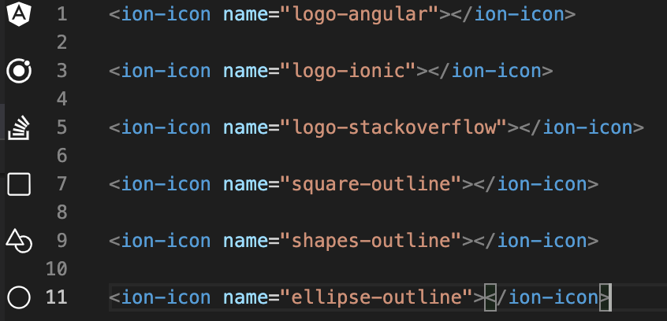

# ionicons 

See ionicons in use in your vscode gutter

## Features





## Requirements

This currently only works for ionic icons used like this

```html
<ion-icon name="close"><ion-icon>
```

## Extension Settings

Include if your extension adds any VS Code settings through the `contributes.configuration` extension point.

For example:

This extension contributes the following settings:

* `ionicons.darkModeIconColor`: What color to use for icons in dark mode, defaults to `white`
* `ionicons.iconsVersion`: Which version of ionicons to use, defaults to `5.4.0`
* `ionicons.logLevel`: What types of log to see in the output section, defaults to `info`

## Known Issues

React ionicons usage is not supported yet.
